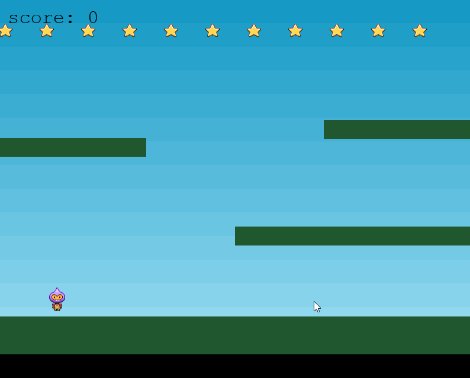

# Экзамен

Результирующая оценка состоит из средней оценки по домашним заданиям (60%) и оценки на экзамене (40%)

Экзамен состоит из двух частей:

1. Теоретические вопросы в виде тестов
2. Практическая часть

## Теоретические вопросы

[Пройти тест](https://forms.office.com/Pages/ResponsePage.aspx?id=HqQqHJJbBkmCfgwQ-dc4WRevbNftn25KtbmWZWQZALNUODVLN1IxWkxFRFk0MUowT1BDSjY5WDc1Si4u)

## Практическая часть

Необходимо дописать игру

Заготовка игры находится в файле [exam.zip](exam.zip)

При запуске игры не будет отображаться счет и собираться звезды.

Необходимо:

1. Реализовать сбор звезд (6 баллов)
2. Отобразить счет в левом верхнем углу (2 балла)
3. За каждую собранную звезду счет увеличивается на 10 (2 балла)
4. Реализовать конец игры когда все звезды собраны (2 бал)

Пишите код начиная с 112 строки в файле `game.js`

Желаю удачи!