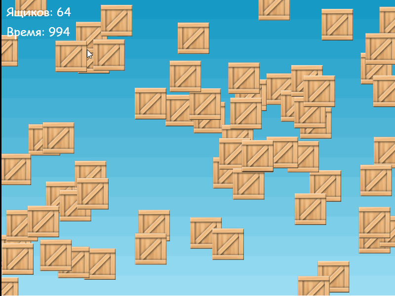

# Практическое задание

Продолжаем делать [инкрементальную игру](https://ru.wikipedia.org/wiki/%D0%98%D0%BD%D0%BA%D1%80%D0%B5%D0%BC%D0%B5%D0%BD%D1%82%D0%B0%D0%BB%D1%8C%D0%BD%D0%B0%D1%8F_%D0%B8%D0%B3%D1%80%D0%B0).

## Шаг 3

Это завершающий шаг на котором мы добавим таймер с обратным отсчетом



Выполните следующие инструкции:

1. Объявим глобальну переменную `time`, которой присвоим значение 1000:

    ```JavaScript
    let time = 1000;
    ```

2. Добавим текстовый элемент для отображения времени.
Для этого объявим глобальную переменную `timer` и в конце функции `create()` добавим следующий код:

    ```JavaScript
    timer = this.add.text(10, 50, 'Время: ' + time, { fontSize: 24, fontFamily: 'cursive' });
    ```

3. Добавим функцию `update()` в которой уменьшим значение счетчика на единицу и в случае, если время или количество ящиков обнулится, то отображаем сообщение о том, что игра закончена и приостанавливаем сцену через метод `this.scene.pause()`:

    ```JavaScript
    function update() {
        time -= 1;
        if(time <= 0 || count <= 0) {
            this.add.text(250, 250, 'Game Over', { fontSize: 60, fontFamily: 'cursive' });
            this.scene.pause();
        }
        timer.setText("Время: " + time);
    }
    ```

<!--
Содержимое всего файла `game.js`:

```JavaScript
/*jshint esversion: 6 */


const config = {
    type: Phaser.AUTO,
    parent: 'game',
    width: 800,
    height: 600,
    scene: {
        preload,
        create,
        update
    }
};

let game = new Phaser.Game(config);
let count = 64;
let info;
let time = 1000;
let timer;

function preload() {
    this.load.image('sky', './img/sky.png');
    this.load.image('box', './img/box.png');
}

function hide() {
    this.visible = false;
    count--;
    info.text = 'Ящиков: ' + count;
}

function create() {
    this.add.image(400, 300, 'sky');

    for (let i = 0; i < count; i++) {
        let box = this.add.sprite(
            Math.random() * 800, 
            Math.random() * 600, 
            'box'
        );
        box.setInteractive();
        box.on('pointerdown', hide);
    }

    info = this.add.text(10, 10, 'Ящиков: ' + count, { fontSize: 24, fontFamily: 'cursive' });

    timer = this.add.text(10, 50, 'Время: ' + time, { fontSize: 24, fontFamily: 'cursive' });
}

function update() {
    time -= 1;
    if(time <= 0) {
        this.add.text(250, 250, 'Game Over', { fontSize: 60, fontFamily: 'cursive' });
        this.scene.pause();
    }
    timer.setText("Время: " + time);
}
```
 -->

Дальнейшим развитием игры может быть добавление звука при клике по ящику, перегрузка игры при нажатии
по кнопке `R` на клавиатуре.
