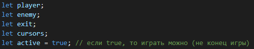
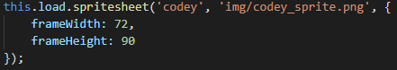
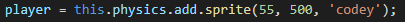
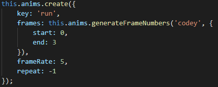
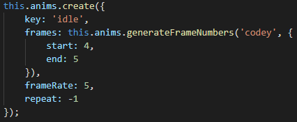
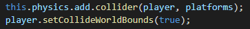

# Практическое задание

На этом практическом занятии мы закрепим знания и создадим игру в которой будет анимация движения игровых объектов.


## Шаг 1

Создаем проект и добавляем изображение со спрайтами игрового объекта. Анимируем перемещение объекта.

1. Загрузить и распаковать архив проекта практического задания [ссылка](animation.zip)
2. Объявить глобальные переменные: `player`, `enemy`, `exit`, `cursors`, `active`
Переменной `active` присвоить значение `true`

    

3. Загружаем набор спрайтов. Для этого в файле `game.js` внутри метода `preload()` вызвать метод `this.load.spritesheet()` в который передать следующие аргументы:
    * 'codey'
    * 'img/codey_sprite.png'
    * { frameWidth: 72, frameHeight: 90 }

    

4. Создаем физический спрайт игрока.
       Для этого в методе create() присвоить переменной player значение возвращаемое методом
       this.physics.add.sprite() при вызове со следующими аргументами:
       * 255
       * 500
       * 'codey'

    

5. Создаем анимацию при передвижении игрока. Для этого внутри метода create()вызываем this.anims.create() и передаем туда следующий объект:

    ```JavaScript
    {
        key: 'run',
        frames: this.anims.generateFrameNumbers('codey', { start: 0, end: 3 }),
        frameRate: 5,
        repeat: -1
    }
    ```

     

6. Создаем анимацию когда игрок стоит. Для этого внутри метода create() вызываем this.anims.create() и передаем туда следующий объект:

    ```JavaScript
    {
        key: 'idle',
        frames: this.anims.generateFrameNumbers('codey', {
            start: 4,
            end: 5
        }),
        frameRate: 5,
        repeat: -1
    }
    ```

    

7. Добавляем коллизию между игроком и платформой, игроком и миром

    

Для управления игроком [переходим ко второму шагу](task02.md)
