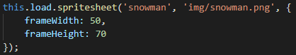
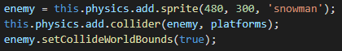
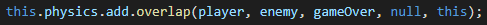
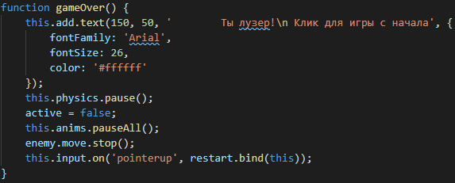
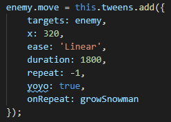

# Практическое задание

Продолжаем практическое занятие. Добавляем врага

## Шаг 4

1. В функции `prelad()` загружаем набор спрайтов `img/snowman.png` для врага с размерами `50 х 70`

    

2. В функции `create()` Создаем физический спрайт врага (`enemy`), добавляем коллизию с платформой и миром

    

3. Добавляем анимацию для `enemy` с именем `snowmanAlert` и запускаем ее

    

4. При пересечении объекта игрока с врагом будем вызывать функцию `gameOver`

    

5. Добавляем функцию `gameOver`

    

6. Добавляем движение врага туда-сюда. Для этого в функции `create()` присвоим значению `enemy.move` результат вызова метода `this.tweens.add()`. В метод передаем объект со следующими атрибутами:
    * targets: gameState.enemy.
    * moves: 320 x-coordinate.
    * ease: 'Linear'.
    * duration: 1800 milliseconds.
    * repeat: -1
    * yoyo: true

     
