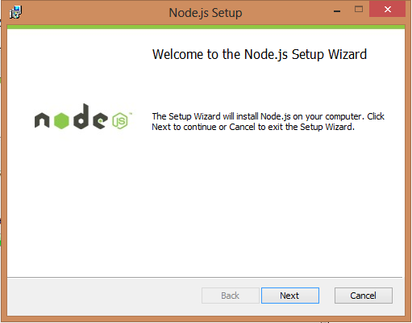
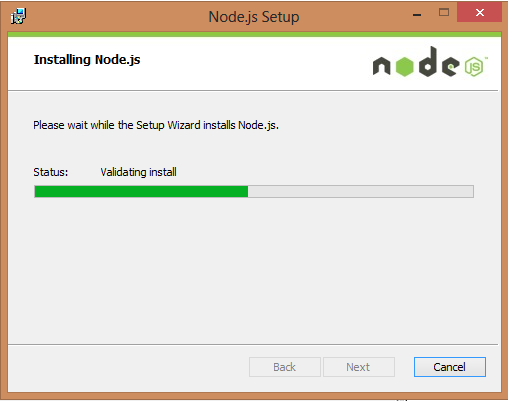
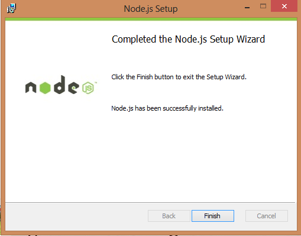
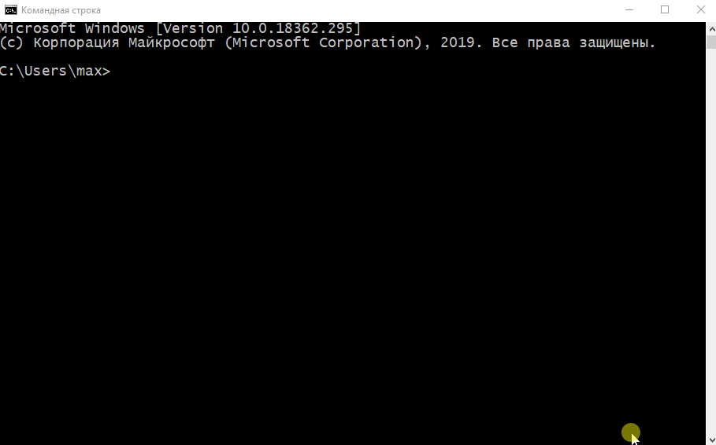
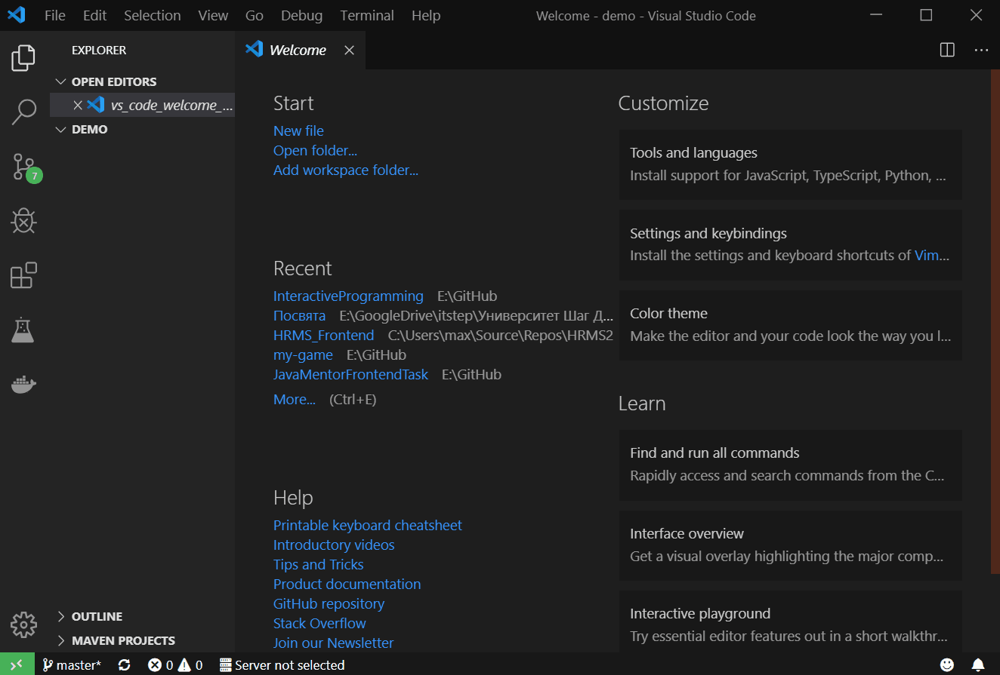
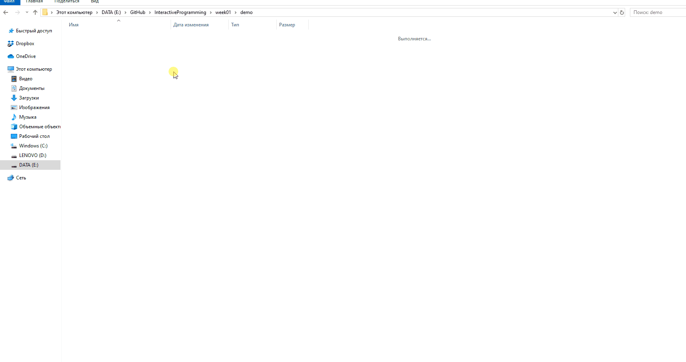
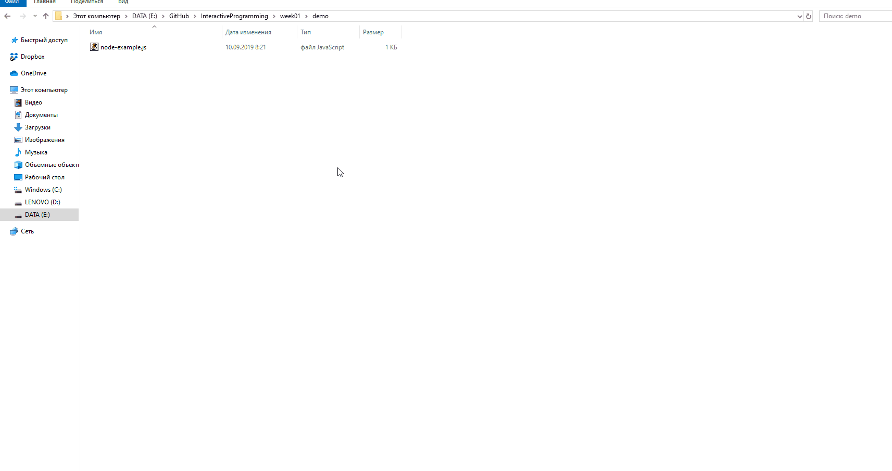

# Неделя 1 - Переменные, выражения, команды

Применение **JavaScript** в качестве калькулятора

## Введение. Почему именно **JavaScript**

**JavaScript** является наиболее популярным языком программирования, на нём написано более 90% всех веб-сайтов. Именно **JavaScript** управляет подвижными элементами на странице, прописывает, что и когда должно произойти в ответ на то или иное действие пользователя. Также **JavaScript** широко применяется в сфере разработки компьютерных игр и мобильных приложений. Всё больше людей пользуется мобильным интернетом, всё больше компаний переносит свой бизнес в онлайн, так что с каждым годом ценность языка **JavaScript** растёт.

В общем, угадайте: какой язык программирования мы будем с вами изучать.

## Установка nodejs. REPL

Первым делом вам понадобится компьютер: стационарный, ноутбук или
Chromebook (но не смартфон или планшет!). Если у вас нет собственного ком-
пьютера, можете воспользоваться компьютером в библиотеке. Или можете
прийти домой к другу, у которого есть компьютер. Ну или можете попробовать
собрать компьютер из проволоки, светодиодов и кастрюли с остывшим пюре (не
рекомендуется).

Далее: на компьютере должна быть установлена операционная система:
Windows (если у вас PC), MacOS (если у вас компьютер от Apple), ChromeOS (если
у вас Chromebook) или Linux (если вы компьютерный гик). Вы должны знать,
какая именно операционка установлена у вас на компьютере.

Следующий шаг - нам нужно установить программу `node.js`.

На официальном [сайте](https://nodejs.org/ru) есть инсталляторы для *Windows* и *Mac OS*, так же есть бинарники для *Linux* пользователей. Мы опишем установку на *Windows*, но общий процесс одинаков для других ОС.

Для того чтобы начать зайдите на страницу загрузки `Node.js`. Выберите установщик который вы хотите скачать и установить. Мы будем использовать **64-bit Windows Installer**. Вам следует использовать пакет исходя от вашей конфигурации.

После загрузки файла, кликаем по нему и запускаем мастер установки.



Проходим по шагам  и ждем пока мастер завершит установку.




Вот и все. Рекомендуется оставлять стандартные настройки во время инсталляции.

`Node.js` поставляется с виртуальным окружением, которое называется **REPL** (или консоль/оболочка Node).
Аббривиатура **REPL** означает Read-Eval-Print-Loop (Читай-Выполняй-Отображай-Повторяй).
Это быстрый и простой способ запустить и протестировать простой код на `Node.js`/`JavaScript`.

Для запуска **REPL**, откройте окно командной строки (в *Windows*) или терминал (в *Mac* или *UNIX/Linux*) и введите строку `node`, как это показано в примере ниже.



В VSC для открытия терминала используется клавиатурная комбинация **Ctrl+Shift+`** или пункт меню *Terminal -> New Terminal*



Теперь можно выполнить любую `Node.js/JavaScript` команду в **REPL**.
Например, если написать `10 + 20` и нажать кнопку `Enter`, то в ответ отобразится чиссло 30 на новой строке.

```javascript
> 10 + 20
30
```

Оператор + (плюс) также соединяет (конкатенирует) строки в `JavaScript`.

```javascript
> "Hello" + "World"
Hello World
```

Также можно объявить переменные и выполнять операции над ними.

```javascript
> var x = 10, y = 20;
> x + y
30
```

Для выхода из **REPL** необходимо нажать дважды **Ctrl+C** или напечатать `.exit` и нажать кнопку **Enter**.

Таким образом можно выполнять любой `Node.js/JavaScript` код в оболчке node (**REPL**).

**REPL** удобен для экспериментов, для выполнения небольших команд и получения мгновенного результата.
Однако в консоли нет возможности сохранить программу и поэтому приходится вводить ее каждый раз при запуске.

Вместо **REPL** можно написать программу на `JavaScript` в файл и выполнить ее.
Например, если есть файл `node-example.js` на диске С вашего компьютера следующего содержимого:

```javascript
console.log("Hello World");
```

То его можно выполнить указав имя файла после команды `node`, как это показано ниже:

```cmd
node node-example.js
```



Благодаря встроенному в Visual Studio Code терминалу код можно выполнить не покидая рекактор.



## Арифметические выражения

Вне зависимости от языка программирования, который вы изучаете,
вы должны хоть чуть‑чуть иметь представление о типах
данных. Любая ваша переменная будет обладать определён‑
ным типом данных; умение определить, каким именно, является
очень полезным навыком, который поможет вам избежать (или
найти и исправить) множество ошибок в коде.

Итак, начнём с простого типа данных — с **чисел**!
**Числа**, как вы знаете, бывают *положительными* и *отрицательными* (а ещё есть
0 — нуль, который ни положительный, ни отрицательный). Любое **число**, пусть
даже десятичная дробь с уймой знаков после запятой, _никогда не берётся в кавычки_.
Примеры чисел:

```JavaScript
> 4
> 282038273
> ‑38
> 51.9
> 0
> -0.000087
```

Мы уже видели такие крутые штуки под названием операторы (сложением).
Теперь мы подробнее рассмотрим их, а также выучим ещё парочку новых.
Для начала быстренько пробежимся по уже известным нам:

Знак плюс (**+**) используется для выражения сложения:

```JavaScript
> 4 + 4
8
```

Минус (**–**) — для вычитания:

```JavaScript
> 7 - 6
1
```

Звёздочкой (__*__) изображается умножение:

```JavaScript
> 3 * 4
12
```

А прямым слэшем (**/**) — деление:

```JavaScript
> 15 / 5
3
```

Если в строке совершается более одного действия, то, чтобы отделить их друг от
друга, а также сделать код более читабельным, мы пользуемся — (скобками).

Давайте наберём следующие предложения в консоли. Ответ по каждому из них
должен состоять только из одной цифры:

```JavaScript
> 3 * (2 + 1);
> (3 + 9) / (10 - 6);
> (2 + (3 * 4)) / (6 + 1);
> (2 * (5 - (8 / 2))) * (3 + 1);
```

Отлично! На этом наш обзор выполнения простых арифметических действий при
помощи консоли закончен. Надеюсь, это всё было вам уже известно, потому что
мы переходим к чему‑то новому…

## Переменные, операции над переменными

**JavaScript**, подобно множеству прочих языков программирования, обладает
строгим **синтаксисом**. **Синтаксис** — это раздел грамматики, изучающий пред-
ложения и способы сочетания слов внутри предложения. Компьютеры не столь
сообразительны, как люди: они не в состоянии «просто понять», что вы имели
в виду. Машина сможет понять вас только в том случае, если вы будете общаться
с ней строго в тех формах выражения, которые она от вас ожидает. Эта ожидаемая
форма выражения и называется синтаксисом.

Рассмотрим пару примеров грамотного применения синтаксиса **JavaScript**. Пере-
печатывайте в консоль все строки кода (пожалуйста, наби-
райте код **В ТОЧНОСТИ** как указано далее) и в конце каждой строки нажимайте
клавишу **Enter**. Приступим:

```JavaScript
> var firstPartGreeting = "Привет,";
```

Объяснение: перед вами так называемые предложения **JavaScript**.
Предложения зачастую заканчиваются точкой с запятой (;).
Ключевое слово `var` в начале строки объявляет интерпретатору JavaScript,
что следующее за ним `firstPartGreeting` является **переменной**. Далее знак
равенства (=) указывает интерпретатору, что мы присваиваем значение "Привет"
нашей переменной `firstPartGreeting`, чтобы
в дальнейшем можно было бы производить с ней операции. Что‑то многовато
длинных‑умных слов, да? Знаю‑знаю, но, пожалуйста, постарайтесь их запомнить,
потому что к ним мы будем обращаться практически постоянно.

```JavaScript
> let secondPartGreeting = "Мир";
undefined
```

Консоль ответила нам: `undefined`.

Объяснение: в этом предложении мы также произвели операцию присваивания
значения. Ключевое слово `let` делает то же самое, что и `var`. Впрочем, некоторые
различия между ними, конечно, есть, но их подробное описание сейчас было бы
излишне, так что ладно. Просто имейте в виду, что несмотря на то, что по боль-
шей части мы здесь будем использовать `let`, не менее часто при дальнейшем
изучении **JavaScript** вы встретитесь и с `var`. В нашем предложении мы присвоили
новой **переменной** `secondPartGreeting` строку ("Мир"). Слово "Мир" называ-
ется строкой, поскольку заключено в кавычки. Ещё вы, наверное, обратили внимание, что в ответ
консоль выдала `undefined`. Не стоит волноваться из‑за этого — подобный ответ
всего лишь означает, что вы пока не определили, что именно должен вернуть
(RETURN) вам в качестве ответа интерпретатор **JavaScript**. Вроде того, что вы бы,
например, сказали интерпретатору: «Слушай, запиши‑ка вот это, чтобы в будущем
мы что‑нибудь с этим могли сделать». Интерпретатор послушно исполнил ваше
приказание и теперь терпеливо дожидается дальнейших инструкций.

Теперь наберём следующий код:

```JavaScript
> let singleSpace = " ";
undefined
```

В ответ получим: `undefined`

**Объяснение**: наше предложение присвоило переменной `singleSpace`
значение строки (содержащей один пробел, заключённый в кавычки). Обратите
внимание: при операции присваивания слева от знака равенства всегда должна
быть лишь одна переменная. Например, `let x = 2 + 2;` является для **JavaScript**
грамотным предложением, в то время как `2 + 2 = let x;` или, скажем,
`2 + 2 = x;` — нет.

```JavaScript
> let fullGreeting = firstPartGreeting + singleSpace + secondPartGreeting;
undefined
```

В ответ получим: `undefined`

**Объяснение**: это очередное присваивание. Кстати говоря, вы заметили, что внутри
всех переменных — `firstPartGreeting`, `secondPartGreeting`, `singleSpace` или
`fullGreeting` — слова пишутся с прописной буквы? А что
между словами нет пробелов? Это вовсе не случайно! В именах переменных не
должно быть пробелов, а сами эти имена, по‑хорошему, должны быть написаны
**«верблюжьимРегистром»** (*camelCase*). Этот стиль подразумевает, что имя пере-
менной начинается со строчной буквы, а каждое следующее слово (или аббревиатура),
входящее в имя переменной, начинается с прописной. Своё название этот
стиль получил оттого, что прописные буквы в середине выглядят будто верблюжьи
горбы. Если вы пока не поняли — просто продолжайте читать: вы столько раз
ещё увидите перед собой **«верблюжийРегистр»**, что в один момент горбы просто
появятся, будто всегда там и были.

```JavaScript
> fullGreeting = fullGreeting + "!!";
"Привет, Мир!!"
```

В ответ получим строку `"Привет, Мир!!"`.

**Объяснение**: в данной операции мы добавляем новую строку ("!!") в конец уже
знакомой нам переменной `fullGreeting`, присваивая затем всю эту удлинённую
строку нашей переменной. Вы заметили отсутствие `let`? Как так вышло?
А так вышло оттого, что `let` используется, когда мы создаём (ещё говорят — объявляем) новую переменную. В нашем же случае мы не создали никакой новой переменной. Переменная
`fullGreeting` уже существует, так что для работы с ней нет необходимости прибегать к let.

```JavaScript
> fullGreeting;
"Привет, Мир!!"
```

В ответ получим строку `"Привет, Мир!!"`.

Объяснение: раз уж мы не совершили нового присваивания или ещё чего,
интерпретатору уже есть что нам вернуть (RETURN)
в ответ! Как если бы вы обратились к интерпретатору
со словами: «Слушай, а теперь выдай‑ка (RETURN) мне зна-
чение той переменной, помнишь?» Соответственно, кон-
соль и выдала вам в ответ нынешнее значение переменной
`fullGreeting`.

Вы уже не раз видели, как при помощи математических операторов происходит
присваивание значений переменным. Например, так:

```JavaScript
> let summ = 5 + 2; // значение суммы — 7
undefined
```

А ещё вы, наверное, не успели позабыть, что в любой момент можно изменить
значение уже известной переменной (разве что вы решите снова прибегнуть
к помощи `let`):

```JavaScript
> summ = summ + 3; // теперь значение суммы стало 10
10
```

С этим всё понятно; теперь проделаем другой занятный трюк. Можно пользоваться
**+=** (читается как «присваивание со сложением») для того, чтобы быстро увеличить
значение переменной! Это называется комбинированным присваиванием,
поскольку сперва имеет место операция над переменной — собственно то, с чем
комбинируется следующее затем присваивание переменной нового значения. Вот
вам несколько примеров (обязательно пропишите их все в консоли):

```JavaScript
> let value = 5;
undefined
> value += 2; // value теперь 7 (то же самое, что value = value + 2;)
7
> value += 3; // value теперь 10 (то же самое, что value = value + 3;)
10
> value = value + value; // 20 (а можно просто value += value;)
20
> value += value; // 40 (то же самое, что value = value + value;)
```

Вы ведь уже догадались, что подобные штуки работают и с прочими математическими действиями, да?!

```JavaScript
> value –= 25; // value теперь 15 (то же, что и value = value − 25;)
15
> value *= 2; // value теперь 30 (то же самое, что value = value * 2;)
30
> value /= 3; // value теперь 10 (то же самое, что value = value / 3;)
10
> value; // Ответ: 10
10
```

Сейчас будет ещё несколько примеров; постарайтесь прежде чем прогнать их все через консоль, самостоятельно угадать ответ:

```JavaScript
> let answer = 0;
?
> answer += 2;
?
> answer *= 30;
?
> answer ‑= 12;
?
> answer /= 6;
?
> answer *= 7 ‑ 5;
?
> answer += answer;
?
> answer;
?
> answer /= 4;
?
> answer ‑= answer;
?
> answer;
```

## Инкремент и декремент (плюс плюс и минус минус)

 __Инкремент__ — это та-кой оператор, который берёт наше число и прибавляет к нему единицу (иногда даже говорят — «инкрементирует»).

Выглядит это так:

```JavaScript
> let counter = 0;
undefined
> counter++;
0
> counter++; // прибавить 1 (при помощи инкремента)
1
> counter;
2
```

И, соответственно, __декремент__ — противоположный оператор, эту единицу отнимающий (то есть «декрементирующий» число):

```JavaScript
> counter--; // вычесть 1 (при помощи декремента)
2
> counter;
1
```

Для более чёткого понимания вот вам три способа, которыми можно выполнить операцию сложения (в подобных случаях зачастую лучше использовать инкремент):

```JavaScript
> counter = counter + 1;
2
> counter += 1;
3
> counter++; // инкремент (предпочтительный способ)
3
> counter;
4
```

И, соответственно, три способа выполнить операцию вычитания (опять же — лучше использовать декремент):

```JavaScript
> counter = counter - 1;
3
> counter -= 1;
2
> counter--; // декремент (предпочтительный способ)
2
> counter;
1
```

## Установка Vistual Studio Code, необходимы плагины (LiveServer, Beautify, Debugger for Chrome, Node.js Extension Pack)

## Вопросы

1. Какие два ключевых слова используются для объявления новых переменных?
2. Какой символ зачастую ставится в конце предложения?
3. Каким символом обозначается операция деления?
4. Каким образом всегда ходят скобки?
5. Какую вы получите, запустив подобное предложение:

    ```JavaScript
    > let summ = (9 + ; 3)
    > console.log(summ);
    ```

6. Какой способ использования прописных букв нужен при наименовании переменных в `JavaScript`?
7. Если у вас есть открывающая ___________, то всегда должна быть и закрывающая _____________.
8. Есть ли в следующем коде синтаксические ошибки (и если есть, то какие)?

    ```JavaScript
    > let myMood = "Вот бы научиться писать код на JavaScript";
    > let myMood = "Не терпится использовать мои новые
    > суперспособности";
    > myMood;
    ```

9. Что означает одиночный знак равенства?
10. Какими символами обозначается инкремент?
11. Какими символами обозначается декремент?
12. Какой будет результат вычисления выражения?

    ```JavaScript
    > let time = 65;
    > let s = time % 60;
    > console.log(s);
    ```

13. Какой это тип данных? `3456`
14. С помощью какого символа можно было бы упростить следующее предложение:

    ```JavaScript
    > value = value + 5;
    ```

## Домашнее задание

1. Установить на домашний компьютер программу `node.js`
2. В файле homework01.js написать программу на `JavaScript`, в которой определить средний возраст ваших ближайших родственников (мамы, папы, братьев, сестёр и, конечно, себя). Результат напечатать в консоль.
3. Прислать файл homework01.js на проверку преподавателю на [mystat](http://mystat.itstep.org).

## Ссылки

1. Мориц Джереми Учимся кодить на JavaScript. — СПб.: Питер, 2019. — 256 с.: ил. — (Серия «Вы и ваш ребенок»).
