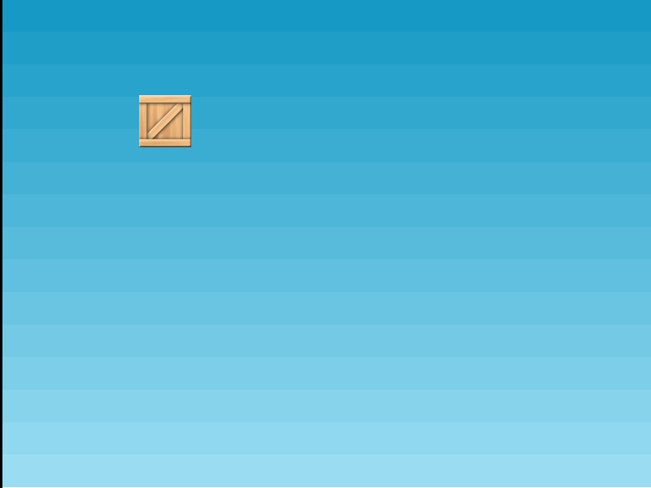

# Практическое задание

Сделаем простую [инкрементальную игру](https://ru.wikipedia.org/wiki/%D0%98%D0%BD%D0%BA%D1%80%D0%B5%D0%BC%D0%B5%D0%BD%D1%82%D0%B0%D0%BB%D1%8C%D0%BD%D0%B0%D1%8F_%D0%B8%D0%B3%D1%80%D0%B0) за три шага.

## Шаг 1

Создаем игрову сцену, добавляем спрайт ящика, скрываем ящик при клике.



Для этого выполните следующие инструкции:

1. Распаковать [заготовку проекта](project.zip) на рабочий стол
2. Открыть папку `project` в `Visual Studion Code`
3. В папку `js` добавить файл `game.js`
4. В файле `game.js` добавить конфигурацию проекта:

    ```JavaScript
    let config = {
        type: Phaser.AUTO,
        parent: 'game',
        width: 800,
        height: 600,
        scene: {
            preload,
            create
        }
    };

    let game = new Phaser.Game(config);

    function preload() {
        // здесь будет ваш код
    }

    function create() {
        // здесь будет ваш код
    }
    ```

5. В функции `preload()` загрузить (`this.load.image()`) файл фона `sky.png` который расположен в папке `img`, дать имя `sky`:

    ```JavaScript
    this.load.image('sky', './img/sky.png');
    ```

6. Аналогичным образом загрузить изображение ящика (файл `box.png`) и дать ему имя `box`
7. В функции `create()` добавить фоновое изображение `sky` (`this.add.image()`) по центру игровой сцены:

    ```JavaScript
    this.add.image(400, 300, 'sky');
    ```

8. Также нам необходимо добавить ящик `box` на сцену место с координатами `x=200, y=150`:

    ```JavaScript
    let box = this.add.sprite(200, 150, 'box');
    ```

9. Сделаем добавленный ящик интерактивным и при клике мышью по игровому объекту скроем его:

    ```JavaScript
    box.setInteractive();

    box.on('pointerdown', hide);
    ```

10. Добавить функцию `hide()` которая будет вызвана при клике по ящику:

    ```JavaScript
    function hide() {
        this.visible = false;
    }
    ```

<!-- 
Содержимое всего файла `game.js`:

```JavaScript
const config = {
    type: Phaser.AUTO,
    parent: 'game',
    width: 800,
    height: 600,
    scene: {
        preload,
        create
    }
};

let game = new Phaser.Game(config);

function preload() {
    this.load.image('sky', './img/sky.png');
    this.load.image('box', './img/box.png');
}

function hide() {
    this.visible = false;
}

function create() {
    this.add.image(400, 300, 'sky');

    let box = this.add.sprite(200, 150, 'box');
    box.setInteractive();
    box.on('pointerdown', hide);
}
```
-->

Переходим ко [второму шагу](task2.md) на котором создадим 64 ящика
