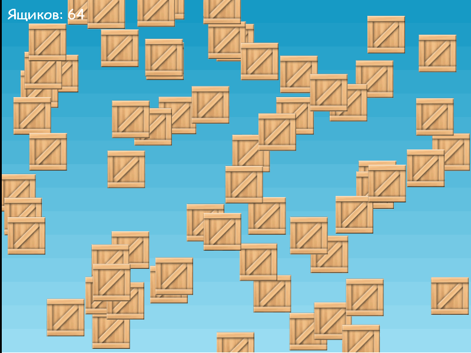

# Практическое задание

Продолжаем делать [инкрементальную игру](https://ru.wikipedia.org/wiki/%D0%98%D0%BD%D0%BA%D1%80%D0%B5%D0%BC%D0%B5%D0%BD%D1%82%D0%B0%D0%BB%D1%8C%D0%BD%D0%B0%D1%8F_%D0%B8%D0%B3%D1%80%D0%B0).

## Шаг 2

На этом шаге нам необходимо добавить 64 ящика и счетчик показывающий количество ящиков на игровой сцене.



Выполните следующие инструкции:

1. Объявим **глобальну** переменную `count`, которой присвоим значение 64:

    ```JavaScript
    let count = 64;
    ```

2. Внутри функции `create()` необходимо бернуть в цикл `for` (повторить `count` раз) следующий код:

    ```JavaScript
    for(let i=0; i<count; i++) {
        let box = this.add.sprite(200, 150, 'box');

        box.setInteractive();
        box.on('pointerdown', hide);
    }
    ```

3. Для того, чтобы ящики размещались в разных местах необходимо сгенерировать случайные координаты
в диапазоне от 0 до 800 - по оси `x` и от 0 до 600 - по оси `y`.
Вспоминайте как мы это делали на прошлых занятиях.

4. Добавим текстовый элемент для отображения количества ящиков ([см. документацию](https://photonstorm.github.io/phaser3-docs/Phaser.GameObjects.Text.html)).
Для этого объявим **глобальную переменную** `info` и в конце функции `create()` добавим следующий код:

    ```JavaScript
    info = this.add.text(10, 10, 'Ящиков: ' + count, { fontSize: 24, fontFamily: 'cursive' });
    ```

5. Теперь в конце функции `hide()` необходимо уменьшать значение переменной `count` на единицу (декремент) и с учетом измененного количества ящиков отображать текст в `info` через метод `setText()`:

    ```JavaScript
    count--;
    info.setText('Ящиков: ' + count);
    ```

<!--
Содержимое всего файла `game.js`:

```JavaScript
const config = {
    type: Phaser.AUTO,
    parent: 'game',
    width: 800,
    height: 600,
    scene: {
        preload,
        create
    }
};

let game = new Phaser.Game(config);
let count = 64;
let info;

function preload() {
    this.load.image('sky', './img/sky.png');
    this.load.image('box', './img/box.png');
}

function hide() {
    this.visible = false;
    count--;
    info.text = 'Ящиков: ' + count;
}

function create() {
    this.add.image(400, 300, 'sky');

    for (let i = 0; i < count; i++) {
        let box = this.add.sprite(
            Math.random() * 800,
            Math.random() * 600,
            'box'
        );
        box.setInteractive();
        box.on('pointerdown', hide);
    }

    info = this.add.text(10, 10, 'Ящиков: ' + count, { fontSize: 24, fontFamily: 'cursive' });
}
```
 -->

Переходим ко [третьему шагу](task3.md) на котором добавим таймер с обратным отсчетом времени
