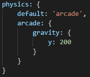
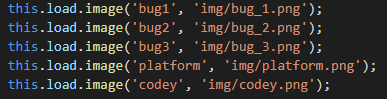
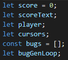
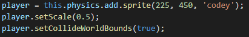
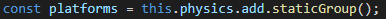
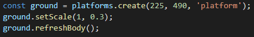
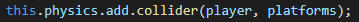
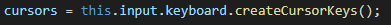
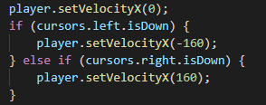

# Практическое задание. Часть 1

На этом практическом занятии мы закрепим знания и создадим простую игру:

## Шаг 1

1. Загрузить и распаковать архив проекта практического задания [ссылка](bugs.zip)
2. Добавить настройки физики в `config`. Задать гравитацию по оси y = 200

    

3. В функции `preload()` через `this.load.image` загрузить изображения из [bug_1.png](solution/img/bug_1.png), [`bug_2.png`](solution/img/bug_2.png), [`bug_3.png`](solution/img/bug_3.png), [`platform.png`](solution/img/platform.png) и [`codey.png`](solution/img/codey.png) из папки [img](solution/img)

    

4. Объявить глобальных переменных `score = 0`, `scoreText`, `player`, `cursors`, `bugGenLoop` и массив `bugs`

    

5. В функции `create()` создать спрайт `player` на основе изображения `codey.png` используя метод `this.physics.add.sprite`. Поместить спрайт в локацию `x = 225`, `y = 450`.
Задать масштаб `player` равный 0.5 (уменьшить в 2 раза) через метод `setScale()`.
Задать коллизию с игровым миром для `player` через метод `setCollideWorldBounds(true)`

    

6. Создаем статическую группу `platforms` через метод `this.physics.add.staticGroup()`

    

7. Из статической группы создаем объект `ground` вызывая метод `create()`.
Задаем масштаб `ground` через метод `setScale(1, 0.3)`.
Обновляем объект `ground` через метод `refreshBody()`

    

8. Что бы игрок не проваливался вниз, а стоял на платформе добавляем коллизию
между `player` и `ground` через метод `this.physics.add.collider()`

    

9. В функции `create()` создать объект `cursors` для управления объектом `player`

    

10. В функции `update()` реализовать движение `player` при нажатии кнопок влево и вправо

    

[Переходим ко второму шагу](task02.md)
