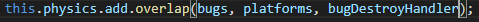

# Практическое задание. Часть 2

Добавляем жуков

## Шаг 2

1. Создаем таймер для генерирования жуков, который будет срабатывать каждые 200 мс, в методе
`create()`  через  метод `this.time.addEvent()`:

    

2. Создаем функцию (вне функции `create()`) для создания жуков. В функции нужно сгенерировать произвольную координату `x`, создать
спрайт и добавить в массив `bugs`:

    

3. Добавляем событие контакта между жуками и платформой используя метод `this.physics.add.overlap()`

    

4. Добавить отдельную функцию (вне функции `create()`), которая должна срабатывать при падении жука на пол

    

5. Добавляем событие контакта между игроком и жуками используя метод `this.physics.add.overlap()`

    

6. Добавить функцию, которая вызывается в конце игры

    

## Дополнительное задание

1. Реализовать счет в игре
2. Использовать всех жуков из папки img
