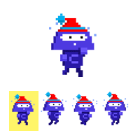

# Animations and Tweens

A static image can only convey so much information. Imagine using a static image for a Sprite and moving it around the game. Will players really get a sense of when it’s walking? or running? Does it stay the same when it’s jumping? Maybe just standing idly by waiting for the player to take control? Instead, we can opt to use animations to distinguish between the many actions our Sprites can do.

In this lesson, we’ll learn how to take a sprite sheet (a single image file that has a Sprite in different poses) and animate it using Phaser. We’ll also introduce another visual tool, tweens, into our games. We’ll take this newfound knowledge and add another dimension to how sprites look, move, and interact inside our Phaser games.

The game we’re developing here is a simple platformer that will help us visualize animations and tweens. As the game develops, you’ll notice we provide for you additional code that builds out the game. When you see our provided code, take some time to read through the comments and refresh yourself on what the code is doing — after all, it’s all concepts we’ve gone over before!

Now, let’s breathe some life into our sprites!

## Sprite Sheets

One common tool used to create animations is a sprite sheet that contains all the images that depict how a sprite can move. Take for instance:



As we move through the frames (individual images) of the sprite sheet, Codey starts walking!

To implement an animation in our game we need to:

1. Load in the sprite sheet.
2. Create the sprite object.
3. Create the animation by selecting specific frames from the sprite sheet.
4. Play the animation.

Let’s focus first on loading in our sprite sheet:

```JavaScript
function preload() {
    this.load.spritesheet( 'spriteKey' , 'spriteSheet.png', { frameWidth: 100, frameHeight: 100 });
}
```

[`this.load.spritesheet()`](https://photonstorm.github.io/phaser3-docs/Phaser.Loader.LoaderPlugin.html#spritesheet__anchor) takes three arguments:

* the sprite’s key as a string,
* the location of the sprite sheet,
* and an object with the properties frameWidth and frameHeight these properties indicate how many pixels wide and tall the individual frames are.

Be sure to use accurate values since inaccurate frameWidth or frameHeight values will result in a misshaped sprite or a nonfunctioning animation!

## Creating the Animation

With our sprite sheet loaded in, we can now create our sprite object and the animation sequence.

This logic goes inside our `create()` method:

```JavaScript
    let exampleSprite;

    // … Previous code
    create() {
        exampleSprite = this.physics.add.sprite(100, 600, 'spriteKey');
    }
}
```

he code above should look familiar, it’s the same way we create a sprite object from a single image. When our sprite loads in game, it’ll show the first frame of our sprite sheet.

We can now use [`this.anims.create()`](https://photonstorm.github.io/phaser3-docs/Phaser.Animations.AnimationManager.html#create__anchor) to create our animations:

```JavaScript
    let exampleSprite;

    // … Previous code
    create() {
        exampleSprite = this.physics.add.sprite(100, 600, 'spriteKey');

         this.anims.create({
            key: 'movement',
            frames: this.anims.generateFrameNumbers('spriteKey', { start: 0, end: 5 }),
            frameRate: 10,
            repeat: -1
        });
    }
}
```

[`this.anims.create()`](https://photonstorm.github.io/phaser3-docs/Phaser.Animations.AnimationManager.html#create__anchor) takes an [object](https://photonstorm.github.io/phaser3-docs/Phaser.Types.Animations.html#.Animation) as an argument that has several properties. In the example above we included:

* key - how this animation will be referenced.
* frames - which frames of the sprite sheet we’re using

    * `this.anims.generateFrameNumbers('spriteKey', { start: 0, end: 5 })` is a Phaser method that returns an array of a sprite sheet’s frames from start up to (and including) end.

* frameRate - how many frames play per second (it will default to 24 if frameRate is not provided).
* repeat - how many times the animation repeats, use -1 to continuously repeat the animation.

## Animating

We have everything else set up, now let’s bring our sprite to life!

Inside `update()`, we can include our logic for controlling our sprite and animating it however we want.

```JavaScript
function update() {
    if (cursors.right.isDown) {
        exampleSprite.setVelocityX(100);
        exampleSprite.anims.play('movement', true);
    }
}
```

In the code above, if the right arrow key is pressed gameState.exampleSprite moves to the right. Then we play the animation by calling gameState.exampleSprite.anims.play('movement', true):

* exampleSprite.anims allows us to access all the animations we created.
* anims.play() will play all the animations, or a single animation if passed an argument.
* We provide .anims.play() with two arguments:
    * the first is an animation key, in this case it’s the movement animation.
    * the second is a boolean, which won’t play the animation from the start, if it’s already in progress.

## Flipping an Animation

Codey’s animation looks great moving to the right. But if we apply the exact same logic to move left, Codey looks like they’re being blown back by some wind or doing the moonwalk. (While it’s cool, it isn’t exactly what we’re going for).

As a fix, we need to set the .flipX property of the animation to be true or false depending on which direction we want our sprite to turn. 

```JavaScript
update() {
    if (cursors.right.isDown) {
      exampleSprite.setVelocityX(100);
      exampleSprite.anims.play('movement', true);
      // The sprite is facing its original direction
      exampleSprite.flipX = false;
    } else if ( gameState.cursors.left.isDown) {
      exampleSprite.setVelocityX(-100);
      exampleSprite.anims.play('movement', true);
      // The sprite is facing its flipped direction
      exampleSprite.flipX = true;
    }
  }
```

When our Sprite is moving to the right, we assign .flipX to false, since our sprite sheet original has the sprite facing the right. Otherwise, when moving left, we assign .flipX to true so that it’s flipped on its x-axis and facing left.

By manipulating .flipX we cam animate our sprite with a sprite sheet that faces one direction!

## Pausing Animations

Learning how to start an animation is one thing, pausing it is another. When it’s game over, or if we decide to include a pause option, we might opt to pause one or all of our animations.

In Phaser, we can call exampleSprite.anims.pause() on the sprite to put a pause on its animation.

We can also call this.anims.pauseAll() to pause all animations in a Scene.

Let’s try out these convenient methods in our own game.

## Tweens

While animations allow us to play through the frames of a sprite sheet, tweens help refine the transition from frame to frame. By creating in-between frames, sprites undergoing changes like their size and positions appear smoother.

One common usage of tweens is to convey movement, for instance:

```JavaScript
 create () {
    exampleSprite = this.physics.sprite.add(0, 100, 'example');

    moveTween = this.tweens.add({
      targets: exampleSprite,
      x: 300,
      ease: 'Linear',
      duration: 3000,
      repeat: -1,
      yoyo: true
    });

    moveTween.play();

    // Later on …
    moveTween.stop();
  }
```

In the code above we called this.tweens.add() to create a tween saved to gameState.moveTween. The object that we provided as an argument:

    targets determines which Sprites are affected (we could’ve also used an array)
    x determines the final x-coordinate of gameState.exampleSprite.
    ease describes how the tween plays.
        We provided a value of Linear which means it plays at a constant speed. But if we wanted some variation, we could have provided another easing function.
    duration determines how long the tween lasts (in milliseconds).
    repeat is how many times the tween runs (use -1 to continuously play).
    yoyo is a true or false value, if it’s true, the tween plays in reverse for the Sprite to return back to its original state (size, position, angle, etc.) before the tween started. If it’s false, then the Sprite will remain as is after the tween finishes.
    To play the tween, we call .play() on gameState.moveTween.
    To stop playing the tween, we call .stop() on gameState.moveTween.

## Tween Callbacks

What if we wanted something to happen after a tween finished playing? Or while it’s looping? How about before it starts playing? Conveniently, Phaser allows us to provide the tween with callback functions.

To use these callbacks, inside the object we passed to this.anims.add(), we assign the following keys callback functions:

    onStart - if we want a function to execute when the tween starts.
    onYoyo - if we want a function to execute when the tween starts going back to the original position.
    onRepeat - if we want a function to execute each time the tween plays.
    onComplete - if we want a function to execute when the tween finishes.

If we wanted to remove our sprite after its tween finished playing, we could call: 

```JavaScript
 create () {
    moveTween = this.tweens.add({
      target: exampleSprite,
      x: 300,
      ease: 'Linear',
      duration: 3000,
      repeat: 1,
      yoyo: true,
      // Will execute after the tween finishes playing:
      onComplete: function() {
        exampleSprite.destroy();
      }
    });

    gameState.moveTween.play();
  }
```

With our tween in place, after our tween plays, the callback for onComplete executes, and destroys gameState.exampleSprite!