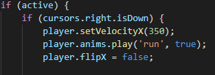
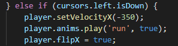
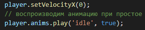
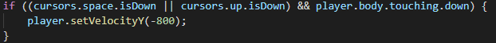

# Практическое задание

Продолжаем практическое занятие. Добавлем управление игроком

## Шаг 2

1. В функцию `update()` добавляем код со следующей логикой: если переменна active равна true И если нажата правая кнопка на клавиатуре, то нужно:
    * установить скорость игрока в направлении оси x равную `350`
    * воспроизвести анимацию через метод  `player.anims.play('run', true)`

    

2. Если же нажата левая кнопка мыши, то
    * установить скорость игрока в направлении оси x равную `-350`
    * воспроизвести анимацию через метод  `player.anims.play('run', true)`

    

3. Если не нажаты кнопки влево или вправо, о задаем скорость 0 и воспроизводим анимацию 'idle'

    

4. Если player косается земли (платформы) и кнопка вверх или пробле нажаты, то задаем скорость в направлении оси у равную -800

    

Для добавления выхода [переходим к третьему шагу](task03.md)
