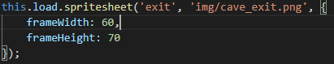
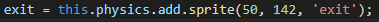
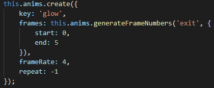
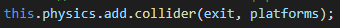
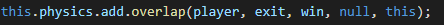
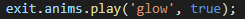
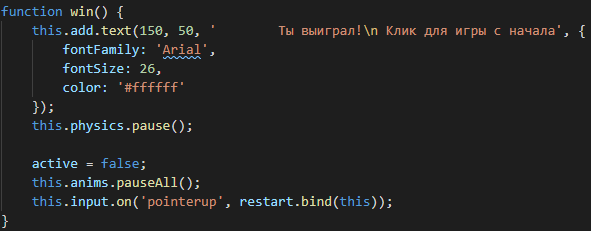
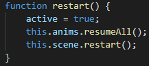

# Практическое задание

Продолжаем практическое занятие. Добавляем выход

## Шаг 3

1. В функции `prelad()` загружаем набор спрайтов для выхода с размерами 60 х 70

    

2. В функции `create()` добавляем физический спрайт и сохраняем в переменной `exit`

    

3. Добавляем анимацию для `exit` с именем `glow`

    

4. Добавляем коллизию с платформой

    

5. Добавляем событие выигрыш при пересечении между объеком `exit` и `player`

    

6. Воспроизводим анимацию `glow`

    

7. Объявляем функцию `win()`, которая будет выполнена при выигрыше

    

8. Реализуем функцию `restart`, которая будет выполнена при перезапуске игры

    

Для добавления врагов [переходим к четвертому шагу](task04.md)
